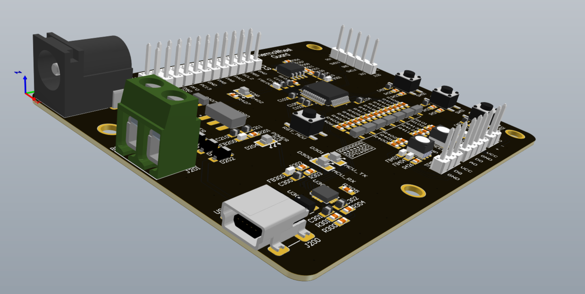

# Proyecto:  THERMOWHEEL GUARD

ThermoWheel Guard es prototipo   de  producto diseñado  para ser capaz de medir la velocidad de una bicicleta y monitorear la temperatura de las pastillas de freno, para evitar accidentes provocados por un sobrecalentamiento debido al uso excesivo del freno de disco.

## Descripción General

El sistema tiene varias funciones clave:

- **Medición de temperatura**: Utiliza un sensor de temperatura para monitorear las pastillas de freno dentro de un rango de -10°C a 80°C.
- **Monitoreo de velocidad**: Un sensor tipo encoder se encarga de medir la velocidad de la bicicleta.
- **Indicadores LED RGB**: Los LEDs RGB indican los niveles de temperatura y velocidad, configurables a través de comandos UART.
- **Almacenamiento de datos**: El dispositivo guarda los valores de temperatura en una memoria flash cada 10 segundos.
- **Configuración del sistema**: A través de botones y comandos UART, se puede configurar la temperatura y la velocidad máxima permitida.
- **Monitoreo de voltaje**: El dispositivo monitorea el voltaje de entrada para detectar si está por debajo del mínimo permitido (4V).

## Características Principales de implementacion

- **Sensor de temperatura** en el rango de -10°C a 80°C, con una frecuencia mínima de 17 mHz.
- **Protección térmica**: La temperatura del dispositivo no debe superar los 50°C sobre la temperatura ambiente a plena carga.
- **Configuración a través de UART**: Permite cambiar los rangos de temperatura y velocidad a través de comandos UART.
- **Indicadores visuales** con LEDs RGB para la temperatura y la velocidad, donde cada color corresponde a un rango específico.
- **Alimentación dual**: El dispositivo se puede alimentar a través de un puerto USB, un power jack de 2.1 mm o una bornera.
- **Medición de RPM**: La velocidad de la bicicleta es medida a través de un sensor tipo encoder y puede ser configurada vía UART.
- **Almacenamiento**: Guarda los datos de temperatura y velocidad en una memoria flash con capacidad para hasta 100.000 datos.

## Limitaciones del Dispositivos 

1. **Rango de temperatura**: -10°C a 80°C.
2. **Frecuencia de sensado de temperatura**: Mínimo 17 mHz.
3. **Límites de operación**:
   - La temperatura del dispositivo no supera los 50°C por encima de la temperatura ambiente.
   - El voltaje de entrada no debe ser menor a 4V.
4. **Modos de operación**:
   - Configuración de temperatura máxima permitida.
   - Configuración del límite de velocidad (RPM máximo).
5. **Interfaz UART**: Para recibir comandos de configuración.
6. **Alimentación**:
   - Power jack de 2.1 mm.
   - Bornera.
   - Puerto USB.

## Indicadores LED RGB

- **Temperatura**:
   - Verde: Entre 0°C y 30°C.
   - Azul: Entre 30°C y 50°C.
   - Rojo: Mayor a 50°C.
- **Velocidad**: Configurable vía UART.

## Conexiones GPIO STM32F030C8T6

El dispovarios pines GPIO del microcontrolador STM32F030C8T6. A continuación, se presenta una tabla con las conexiones y funciones correspondientes.

| **Componente**                 | **Pin GPIO**               | **Puerto GPIO** |
|---------------------------------|----------------------------|-----------------|
| Sensor de temperatura (DS18B20) | `GPIO_PIN_2`               | `GPIOA`         |
| Sensor de velocidad analógico   | `GPIO_PIN_3`               | `GPIOA`         |
| Sensor de velocidad digital     | `GPIO_PIN_4`               | `GPIOA`         |
| LED RGB (Azul - Temperatura)    | `GPIO_PIN_7`               | `GPIOA`         |
| LED RGB (Verde - Temperatura)   | `GPIO_PIN_0`               | `GPIOB`         |
| LED RGB (Rojo - Temperatura)    | `GPIO_PIN_1`               | `GPIOB`         |
| LED RGB (Azul - Velocidad)      | `GPIO_PIN_2`               | `GPIOB`         |
| LED RGB (Verde - Velocidad)     | `GPIO_PIN_10`              | `GPIOB`         |
| LED RGB (Rojo - Velocidad)      | `GPIO_PIN_11`              | `GPIOB`         |
| Botón "Down"                   | `GPIO_PIN_12`              | `GPIOB`         |
| Botón "Mode"                   | `GPIO_PIN_13`              | `GPIOB`         |
| Botón "Up"                     | `GPIO_PIN_14`              | `GPIOB`         |
| LED de configuración            | `GPIO_PIN_8`               | `GPIOA`         |
| Pin de carga                   | `GPIO_PIN_12`              | `GPIOA`         |
| Flash (CS)                     | `GPIO_PIN_15`              | `GPIOA`         |
| Flash (SCK)                    | `GPIO_PIN_3`               | `GPIOB`         |
| Flash (MISO)                   | `GPIO_PIN_4`               | `GPIOB`         |
| Flash (MOSI)                   | `GPIO_PIN_5`               | `GPIOB`         |
| UART TX                        | `GPIO_PIN_6`               | `GPIOB`         |
| UART RX                        | `GPIO_PIN_7`               | `GPIOB`         |

## Funciones y Modos de Operación

### Monitoreo de Temperatura

- **Sensado**: El dispositivo mide la temperatura cada 10 segundos y la almacena en una memoria flash.
- **LEDs RGB**: Los LEDs RGB cambian de color dependiendo de la temperatura actual:
  - Verde (0°C - 30°C).
  - Azul (30°C - 50°C).
  - Rojo (Mayor a 50°C).
  
### Monitoreo de Velocidad

- El sensor tipo encoder mide la velocidad de la bicicleta.
- El LED RGB cambia de color según la velocidad actual, configurada vía UART.
- Se puede establecer un RPM máximo, el cual, al ser excedido, encenderá un LED rojo.
- El dispositivo guarda el valor promedio de RPM de los últimos 3 minutos en la memoria flash.

### Interfaz UART

El dispositivo responde a comandos enviados vía UART para:

- **Cambiar los rangos de temperatura** para los colores del LED (verde, azul, rojo).
- **Configurar el límite de RPM**.
- **Obtener la información** guardada en la memoria flash (temperatura y RPM).
- **Borrar la memoria flash**.

### Alimentación

El dispositivo se puede alimentar a través de tres medios:

1. **Power Jack** de 2.1 mm.
2. **Bornera**.
3. **Puerto USB**.

El sistema monitorea continuamente el voltaje de entrada para asegurarse de que no caiga por debajo de los 4V.

## Programa para Pruebas Iniciales

El software inicial incluye las siguientes funciones:

- **Frecuencia de sensado**: 0.1 Hz para la temperatura.
- **Encendido de LEDs**: Según el rango de temperatura, los LEDs cambiarán de color.
- **Lectura y escritura en Flash**: El dispositivo leerá los rangos de temperatura desde la memoria flash al inicio y permitirá configurarlos vía UART.
- **RPM**: El dispositivo encenderá un LED verde si detecta movimiento en la bicicleta y cambiará a rojo si no detecta movimiento después de un tiempo.
- **Almacenamiento**: El valor promedio del RPM de los últimos 3 minutos se guarda en flash.

## Comandos UART

A través de UART, puedes ejecutar los siguientes comandos:

- **Cambiar el rango mínimo y máximo de temperatura para el LED verde**.
- **Cambiar l rango mínimo y máximo de temperatura para el LED azul**.
- **Cambiar el rango mínimo y máximo de temperatura para el LED rojo**.
- **Configurar el límite de RPM**.

| Comando | Descripción                   |
|---------|-------------------------------|
| `F1 -> MIN_R=`       | Establecer el valor mínimo de `R` |
| `F2 -> MAX_R=`       | Establecer el valor máximo de `R` |
| `F3 -> MAX_G=`       | Establecer el valor mínimo de `G` |
| `F4 ->  MIN_G=`       | Establecer el valor máximo de `G` |
| `F5 -> MIN_B=`       | Establecer el valor mínimo de `B` |
| `F6 -> MAX_B=`       | Establecer el valor m áximo de `B` |
| `F7 -> MAX_RPM=`     | Establecer el valor máximo de RPM |
| `F8 -> TEMP_GET_MEAN=` | Obtener la temperatura promedio |
| `F9 -> SPEED_GET_MEAN=` | Obtener la velocidad promedio   |

| Comando           | Activador        | Descripcion             |
|-------------------|-------------------|----------------------|
|  `F1`   |  ` MIN_R`   |   Establecer el valor mínimo de `R`  |
|   `F2 `  |  `MAX_R`   |    Establecer el valor máximo de `R`  |
|  `F3`   | ` MAX_G`    |   Establecer el valor mínimo de `G` |
|   `F4`  |  ` MIN_G`   |   Establecer el valor máximo de `G`  |
|   `F5`  |  ` MIN_B`   |   Establecer el valor mínimo de `B`    |
|   `F6`  |  `MAX_B`   |   Establecer el valor máximo de `B`  |
|   `F7 `  | `MAX_RPM`    |   Establecer el valor máximo de RPM   |
|  `F8`   |   ` TEMP_GET_MEAN`  |  Obtener la temperatura promedio   |
|   `F9`  |   `SPEED_GET_MEAN`  |   Obtener la velocidad promedio  |

# Documentacion /Flujo :Firmware

El Firmaware del proyecto contiene los siguientes directorios y archivos de funcinamiento de este:

- **Src/**: Contiene el código principal del funcionamen del proyecto(.c).
- **Inc/**: Contiene los archivos headers  para las funciones y configuraciones de perisfericos  dispositivo(.h).
- **Drivers/**: .

## `SRC/`: Contiene el código principal del funcionamen del proyecto(.c).

### `main.c`

Archivo principal que tiene  del programa que realiza las configuraciónes iniciales del sistema y el bucle principal que controla el flujo del dispositivo.

### Variables Globales

- **Periféricos:**
  - `ADC_HandleTypeDef hadc`: Manejador del ADC.
  - `SPI_HandleTypeDef hspi1`: Manejador del SPI1.
  - `TIM_HandleTypeDef htim3`: Manejador del TIM3.
  - `UART_HandleTypeDef huart1`: Manejador del UART1.
  
- **Buffers y Comunicación:**
  - `ring_buffer_t rb_usart1`: Buffer circular para UART1.
  - `uint8_t rb_buffer_usart1[CAPACITY_USART1]`: Buffer de datos para UART1.
  - `uint8_t data_usart1_rx`: Dato recibido por UART1.
  - `uint8_t data_rb_usart1`: Dato leído del buffer circular.
  - `uint8_t buffer_usart1_rx[CAPACITY_BUFFER_USART1_RX]`: Buffer de recepción de UART1.
  - `uint8_t read_buffer_ring_counter`: Contador del buffer de recepción.
  - `uint8_t key[CAPACITY_KEY]`: Clave recibida por UART.
  - `uint8_t value_str[CAPACITY_VALUE]`: Valor recibido por UART.
  - `double value_decimal`: Valor decimal recibido por UART.
  - `uint8_t transmit_text[CAPACITY_TRANSMIT_TEXT]`: Texto a transmitir por UART.
  - `uint8_t size_to_send`: Tamaño del texto a transmitir.

- **Control de Temperatura:**
  - `uint32_t temperature_printing_control`: Control de impresión de temperatura.
  - `RGB_LEDS_struct_t parameter_RGB_leds`: Parámetros de los LEDs RGB.
  - `boolean_enum key_flag`: Indicador de recepción de clave.
  - `boolean_enum new_parameter_to_set_flag`: Indicador de nuevo parámetro a configurar.
  - `float temperature`: Temperatura medida.
  - `float temperature_mean`: Temperatura media.
  - `uint8_t counter_for_mean`: Contador para el cálculo de la media.
  - `float values_for_mean[MAX_MEASURES_OF_TEMPERATURE_FOR_MEAN]`: Valores para el cálculo de la media.
  - `int8_t min_red_temperature`: Temperatura mínima para el LED rojo.
  - `int8_t max_red_temperature`: Temperatura máxima para el LED rojo.
  - `int8_t min_green_temperature`: Temperatura mínima para el LED verde.
  - `int8_t max_green_temperature`: Temperatura máxima para el LED verde.
  - `int8_t min_blue_temperature`: Temperatura mínima para el LED azul.
  - `int8_t max_blue_temperature`: Temperatura máxima para el LED azul.

- **Control de Velocidad:**

  - `float counter_speed_pulse`: Contador de pulsos de velocidad.
  - `uint32_t time_measure_speed`: Tiempo de medición de velocidad.
  - `float speed_in_RPM`: Velocidad en RPM.
  - `uint32_t time_print_speed`: Tiempo de impresión de velocidad.
  - `uint8_t speed_mean_counter`: Contador para el cálculo de la media de velocidad.
  - `float values_for_mean_speed[MAX_MEASURES_OF_SPEED_FOR_MEAN]`: Valores para el cálculo de la media de velocidad.
  - `float speed_mean`: Velocidad media.
  - `boolean_enum move_speed_flag`: Indicador de movimiento de velocidad.
  - `uint32_t last_move_speed`: Último movimiento de velocidad.
  - `float max_speed_RPM`: Velocidad máxima en RPM.

- **Control de Boton y Uso de la Flash:**
  - `uint32_t last_press_button`: Última pulsación del botón.
  - `extern uint8_t read_flash_Byte[255]`: Datos leídos de la memoria flash.
  - `volatile uint8_t address_to_write[3]`: Dirección para escribir en la memoria flash.
  - `uint8_t things_to_write[255]`: Datos a escribir en la memoria flash.
  - `uint8_t size_to_write_flash`: Tamaño de los datos a escribir en la memoria flash.
  - `uint8_t status_reg1`: Registro de estado 1.
  - `uint8_t status_reg2`: Registro de estado 2.
  - `uint8_t status_reg3`: Registro de estado 3.

### Funciones Principales

- **Inicialización del Sistema:**
  - `void SystemClock_Config(void)`: Configura el reloj del sistema.
  - `static void MX_GPIO_Init(void)`: Inicializa los pines GPIO.
  - `static void MX_SPI1_Init(void)`: Inicializa el periférico SPI1.
  - `static void MX_TIM3_Init(void)`: Inicializa el temporizador TIM3.
  - `static void MX_USART1_UART_Init(void)`: Inicializa el periférico UART1.
  - `static void MX_ADC_Init(void)`: Inicializa el ADC.

- **Funciones de Usuario:**
- `void print_temperature(void)`: Imprime la temperatura medida.
- `void update_temperature_indicator(void)`: Actualiza el indicador de temperatura.
- `void set_value_received(void)`: Configura el valor recibido a través de UART.
- `void calculate_mean_temperature(void)`: Calcula la temperatura media.
- `void measure_speed_RPM(void)`: Mide la velocidad en RPM.
- `void print_speed(void)`: Imprime la velocidad medida.
- `void calculate_mean_speed(void)`: Calcula la velocidad media.
- `int8_t read_flash(uint8_t address_1, uint8_t address_2, uint8_t address_3, uint8_t aux_length)`: Lee datos de la memoria flash.
- `void write_flash(uint8_t address_1, uint8_t address_2, uint8_t address_3, int value_to_write, uint8_t length)`: Escribe datos en la memoria flash.

- **Funciones de Interrupción:**
  - `void HAL_UART_RxCpltCallback(UART_HandleTypeDef *huart)`: Callback de recepción completa de UART.
  - `void HAL_GPIO_EXTI_Callback(uint16_t GPIO_Pin)`: Callback de interrupción externa de GPIO

### Flujo Principal

1. **Inicialización:**
   - Se inicializan los periféricos y se configuran los parámetros iniciales.
   - Se inicia el temporizador TIM3 y el sensor de temperatura DS18B20.
   - Se configuran los LEDs RGB y el buffer circular para UART1.

2. **Bucle Principal:**
   - Se verifica si hay datos en el buffer de UART y se procesan.
   - Se actualizan los indicadores de temperatura y se imprime la temperatura medida.
   - Se calcula la temperatura media después de un número específico de mediciones.

---
## **`Flash.c`**: Contiene funciones para interactuar con la memoria flash a través del protocolo SPI. A continuación se describen las funciones y variables más importantes incluidas en este archivo.

## Variables Globales

- `uint8_t read_flash_Byte[256]`: Buffer para almacenar los datos leídos de la memoria flash.
- `extern SPI_HandleTypeDef hspi1`: Manejador del periférico SPI1.

## Funciones Principales

### Funciones de Lectura

- `void Flash_read_identification_id()`: Lee el ID de identificación de la memoria flash.
- `void Flash_read_status1_register(uint8_t *reg_to_save)`: Lee el registro de estado 1 de la memoria flash.
- `void Flash_read_status2_register(uint8_t *reg_to_save)`: Lee el registro de estado 2 de la memoria flash.
- `void Flash_read_status3_register(uint8_t *reg_to_save)`: Lee el registro de estado 3 de la memoria flash.
- `void Flash_read_page(uint8_t address_1, uint8_t address_2, uint8_t address_3, uint8_t aux_length)`: Lee una página de la memoria flash.

### Funciones de Escritura

- `void Flash_write_page(uint8_t address_1, uint8_t address_2, uint8_t address_3, uint8_t *value_to_write, uint8_t length)`: Escribe una página en la memoria flash.
- `void Flash_activate_deactivate_block_protect()`: Activa o desactiva la protección de bloque en la memoria flash.
- `void Write_flash_enable()`: Habilita la escritura en la memoria flash.

### Funciones de Borrado

- `void Flash_page_erase(uint8_t address_1, uint8_t address_2, uint8_t address_3)`: Borra una página de la memoria flash.
- `void Flash_sector_erase(uint8_t address_1, uint8_t address_2, uint8_t address_3)`: Borra un sector de la memoria flash.
- `void Flash_block_erase(uint8_t address_1, uint8_t address_2, uint8_t address_3)`: Borra un bloque de la memoria flash.
- `void erase_all()`: Borra toda la memoria flash.

### Funciones Auxiliares

- `void flash_csn(uint8_t val)`: Controla el pin CSN (Chip Select Not) para la comunicación SPI.
- `void Flash_verificate_status()`: Verifica el estado de la memoria flash.

## Descripción de las Funciones

### `Flash_read_identification_id()`

Lee el ID de identificación de la memoria flash y lo almacena en el buffer `read_flash_Byte`.

### `flash_csn(uint8_t val)`

Controla el pin CSN para iniciar o finalizar la comunicación SPI. Si `val` es 0, pone el pin CSN en bajo; si es 1, lo pone en alto.

### `Flash_read_status1_register(uint8_t *reg_to_save)`

Lee el registro de estado 1 de la memoria flash y almacena el valor en `reg_to_save`.

### `Flash_read_status2_register(uint8_t *reg_to_save)`

Lee el registro de estado 2 de la memoria flash y almacena el valor en `reg_to_save`.

### `Flash_read_status3_register(uint8_t *reg_to_save)`

Lee el registro de estado 3 de la memoria flash y almacena el valor en `reg_to_save`.

### `Flash_activate_deactivate_block_protect()`

Activa o desactiva la protección de bloque en la memoria flash escribiendo en el registro de estado 1.

### `Write_flash_enable()`

Habilita la escritura en la memoria flash enviando el comando WREN.

### `Flash_verificate_status()`

Verifica el estado de la memoria flash leyendo el registro de estado 1 y esperando a que el bit de ocupado (busy) se ponga en 0.

### `Flash_write_page(uint8_t address_1, uint8_t address_2, uint8_t address_3, uint8_t *value_to_write, uint8_t length)`

Escribe una página en la memoria flash en la dirección especificada.

### `Flash_read_page(uint8_t address_1, uint8_t address_2, uint8_t address_3, uint8_t aux_length)`

Lee una página de la memoria flash desde la dirección especificada y almacena los datos en `read_flash_Byte`.

### `Flash_page_erase(uint8_t address_1, uint8_t address_2, uint8_t address_3)`

Borra una página de la memoria flash en la dirección especificada.

### `Flash_sector_erase(uint8_t address_1, uint8_t address_2, uint8_t address_3)`

Borra un sector de la memoria flash en la dirección especificada.

### `Flash_block_erase(uint8_t address_1, uint8_t address_2, uint8_t address_3)`

Borra un bloque de la memoria flash en la dirección especificada.

### `erase_all()`

Borra toda la memoria flash enviando el comando `ERASE_ALL_COMAND`.
---
 ## **`stm32f0xx_it.c`**: Maneja las rutinas de interrupción del microcontrolador, incluyendo interrupciones para UART y temporizadores.

 Este archivo contiene las rutinas de interrupción para el microcontrolador STM32F0xx. Algunas de las interrupciones manejadas en este archivo son:

- `NMI_Handler()`: Manejador de la interrupción de no máscara.
- `HardFault_Handler()`: Manejador de la interrupción de fallo grave.
- `SysTick_Handler()`: Manejador de la interrupción del SysTick.
- `USART1_IRQHandler()`: Manejador de la interrupción del UART1.
- `TIM3_IRQHandler()`: Manejador de la interrupción del TIM3.

---

## **`stm32f0xx_hal_msp.c`**: Tiene las funciones de inicialización y desinicialización del MSP (Microcontroller Support Package).
Este archivo contiene las funciones de inicialización y desinicialización del MSP (Microcontroller Support Package). Algunas de las funciones incluidas son:

- `HAL_MspInit()`: Inicializa el MSP.
- `HAL_MspDeInit()`: Desinicializa el MSP.
- `HAL_ADC_MspInit()`: Inicializa el MSP para el ADC.
- `HAL_ADC_MspDeInit()`: Desinicializa el MSP para el ADC.
- `HAL_TIM_Base_MspInit()`: Inicializa el MSP para el temporizador base.
- `HAL_TIM_Base_MspDeInit()`: Desinicializa el MSP para el temporizador base.
- `HAL_UART_MspInit()`: Inicializa el MSP para el UART.
- `HAL_UART_MspDeInit()`: Desinicializa el MSP para el UART.
---

## **`RGB_LED.c`**: Controla los LEDs RGB y sus funciones.

Este archivo contiene las funciones para controlar los LEDs RGB. Algunas de las funciones incluidas son:

- `RGB_Init()`: Inicializa los LEDs RGB.
- `RGB_RED_ON()`: Enciende el LED rojo.
- `RGB_GREEN_ON()`: Enciende el LED verde.
- `RGB_BLUE_ON()`: Enciende el LED azul.
- `RGB_ALL_OFF()`: Apaga todos los LEDs.
---

## **`ring_buffer.c`**: Implementa un buffer circular para la gestión de datos de UART.

Este archivo contiene las funciones para manejar un buffer circular. Algunas de las funciones incluidas son:

- `ring_buffer_init()`: Inicializa el buffer circular.
- `ring_buffer_write()`: Escribe un dato en el buffer circular.
- `ring_buffer_read()`: Lee un dato del buffer circular.
- `ring_buffer_is_empty()`: Verifica si el buffer circular está vacío.
- `ring_buffer_size()`: Obtiene el tamaño del buffer circular.

---

## **`DS18B20.c`**: Fucniones y configuraciones para la gestión del sensor de temperatura DS18B20.

Este archivo contiene las funciones para manejar el sensor de temperatura DS18B20. Algunas de las funciones incluidas son:

- `DS18B20_Init()`: Inicializa el sensor DS18B20.
- `DS18B20_Get_temperature()`: Obtiene la temperatura medida por el sensor DS18B20.
---

## Configuración  de Perifericos

+

- **ADC**: Se utiliza  para la lectura de señales analógicas que se vayan manejar(recordar que hay GPIO disponibles para otro uso, esto se ve en el hardware ).
- **UART**: Comunicación serie para recibir y enviar datos a través de UART1.
- **SPI**: Comunicación con periféricos a través del bus SPI1.
- **TIM**: Temporizador TIM3 utilizado para realizar mediciones de temperatura y otras tareas temporizadas (Tambien diponibles en los pines GPIO dispinibles, esto se ve en el hardware).
- **GPIO**: Control de los pines de entrada/salida.

### Variables Globales Clave
- **Buffers de comunicación**: Gestionan la recepción y transmisión de datos por UART, incluyendo el buffer circular `ring_buffer_t` para el manejo eficiente de datos en serie.
- **Control de temperatura**: La temperatura medida se gestiona en una variable flotante, y se calculan valores promedios para estabilizar las lecturas.
- **Control de LEDs RGB**: Se utilizan para mostrar de manera visual el estado de la temperatura, con umbrales configurables para cambiar el color de los LEDs según los valores de temperatura.

## Funciones Clave

### Control de Temperatura

- **print_temperature()**: Imprime la temperatura medida a través de UART.
- **calculate_mean_temperature()**: Calcula la temperatura promedio tras una serie de mediciones.
- **update_temperature_indicator()**: Actualiza el estado de los LEDs RGB según los valores de temperatura.

### Comunicación Serie

- **HAL_UART_RxCpltCallback()**: Maneja las interrupciones de recepción de UART, almacenando los datos en el buffer circular.

### Control de LEDs RGB

- **RGB_RED_ON(), RGB_GREEN_ON(), RGB_BLUE_ON()**: Controlan el encendido de los LEDs según los rangos de temperatura.
- **RGB_ALL_OFF()**: Apaga todos los LEDs.

-----------------------

# **`Inc/`**: Contiene los archivos headers  para las funciones y configuraciones de perisfericos  dispositivo(.h).

## **`main.h`**: Contiene las definiciones y prototipos de funciones para la configuración inicial del sistema y la función principal del programa.

## **`DS18B20.h`**: Contiene las definiciones y prototipos  de las funciones para manejar el sensor de temperatura.

- `void DS18B20_Init(void)`: Inicializa el sensor DS18B20.
- `float DS18B20_Get_temperature( void )`: Obtiene la temperatura medida por el sensor DS18B20.

## **`RGB_LED.h`**: contiene las definiciones y prototipos de funciones para controlar los LEDs RGB.

**Enumeraciones**

- ID_LED: Identificadores de los LEDs RGB.
  - NONE
  - SPEED
  - TEMPERATURE

**Estructuras**

- RGB_LEDS_struct_t: Estructura para configurar los puertos y pines de los LEDs RGB.

**Funciones**

- `void RGB_Init(RGB_LEDS_struct_t parameters)`: Inicializa los LEDs RGB.
- `void RGB_RED_ON(ID_LED ID)`: Enciende el LED rojo.
- `void RGB_GREEN_ON(ID_LED ID)`: Enciende el LED verde.
- `void RGB_BLUE_ON(ID_LED ID)`: Enciende el LED azul.
- `void RGB_ALL_OFF(ID_LED ID)`: Apaga todos los LEDs.

## **`ring_buffer.h`**: Contiene las definiciones y prototipos de funciones para manejar un buffer circular.

**Estructuras**

- `ring_buffer_t`: Estructura que representa un buffer circular.

**Funciones**

- `void ring_buffer_init(ring_buffer_t *rb, uint8_t *buffer, size_t size)`: Inicializa el buffer circular.
- `int ring_buffer_write(ring_buffer_t *rb, uint8_t data)`: Escribe un dato en el buffer circular.
- `int ring_buffer_read(ring_buffer_t *rb, uint8_t *data)`: Lee un dato del buffer circular.
- `int ring_buffer_is_empty(const ring_buffer_t *rb)`: Verifica si el buffer circular está vacío.
- `size_t ring_buffer_size(const ring_buffer_t *rb)`: Obtiene el tamaño del buffer circular.

## **`stm32f0xx_it.h`**: Contiene las definiciones y prototipos de funciones para manejar las interrupciones del microcontrolador STM32F0xx.

**Funciones**

- `void NMI_Handler(void)`: Manejador de la interrupción de no máscara.
- `void HardFault_Handler(void)`: Manejador de la interrupción de fallo grave.
- `void SysTick_Handler(void)`: Manejador de la interrupción del SysTick.
- `void USART1_IRQHandler(void)`: Manejador de la interrupción del UART1.
- `void TIM3_IRQHandler(void)`: Manejador de la interrupción del TIM3.

## **`stm32f0xx_hal_msp.h`**: Contiene las definiciones y prototipos de funciones para la inicialización y desinicialización del MSP (Microcontroller Support Package).

**Funciones**

- `void HAL_MspInit(void)`: Inicializa el MSP.
- `void HAL_MspDeInit(void)`: Desinicializa el MSP.
- `void HAL_ADC_MspInit(ADC_HandleTypeDef* hadc)`: Inicializa el MSP para el ADC.
- `void HAL_ADC_MspDeInit(ADC_HandleTypeDef* hadc)`: Desinicializa el MSP para el ADC.
- `void HAL_TIM_Base_MspInit(TIM_HandleTypeDef* htim_base)`: Inicializa el MSP para el temporizador base.
- `void HAL_TIM_Base_MspDeInit(TIM_HandleTypeDef* htim_base)`: Desinicializa el MSP para el temporizador base.
- `void HAL_UART_MspInit(UART_HandleTypeDef* huart)`: Inicializa el MSP para el UART.
- `void HAL_UART_MspDeInit(UART_HandleTypeDef* huart)`: Desinicializa el MSP para el UART.

## **`system_stm32f0xx.h`**: Contiene las definiciones y prototipos de funciones para la configuración del sistema del microcontrolador STM32F0xx.

**Funciones**

- `void SystemInit(void)`: Inicializa el sistema.
- `void SystemCoreClockUpdate(void)`: Actualiza la frecuencia del reloj del sistema.

